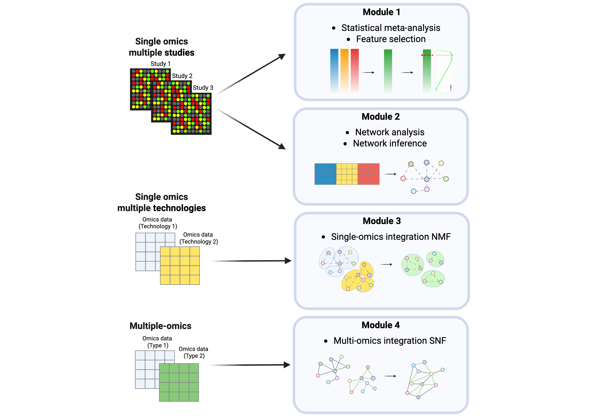

# MUUMI: an R package for statistical and network-based meta-analysis for MUlti-omics data Integration

MUUMI is an R package designed to enable the integration and interpretation of multi-omics data by combining statistical meta-analysis with network-based methodologies. It enables robust identification of molecular signatures across single- and multi-omics datasets, addressing common challenges such as platform heterogeneity and batch effects. MUUMI supports an ensemble of meta-analytical approaches—including effect size, p-value combination, and rank product—while offering tools for batch effect mitigation, gene prioritization and feature selection, and network inference. Through integrated network analysis, it facilitates community detection, pathway enrichment, and topological interpretation via both node- and edge-level annotations (GSEA and ESEA). MUUMI also implements advanced integration strategies: from aggregating community structures across multiple studies and technologies, to fusing different omics layers using Similarity Network Fusion (SNF). The functionalities of MUUMI are reported in two case studies. In the first case study, we integrated 17 transcriptomics datasets (microarray + RNA-Seq) from idiopathic pulmonary fibrosis (IPF) patients to uncover fibrosis-related molecular signatures, disrupted biological pathways (e.g., ECM remodeling, mitochondrial dysfunction), and immune dysregulation. In the second, we investigated macrophage polarisation through multi-omics integration of transcriptome and methylome data. MUUMI reveals condition-specific regulatory pathways under pro- and anti-inflammatory stimuli, highlighting key immune and metabolic responses.





The package implements the methods and algorithms described in the following scientific publication:

> **S. Inkala** (2025). *MUUMI: an R package for statistical and network-based meta-analysis for MUlti-omics data Integration*. bioRxiv, DOI: [10.1101/2025.03.10.642416](https://doi.org/10.1101/2025.03.10.642416).

If you use this package in your research, please cite the paper using the citation provided.

## Installation
To install MUUMI, first install its dependencies:

```
clusterProfiler >= 3.14.3 
doParallel >= 1.0.16 
dplyr >= 1.0.2 
esc >= 0.5.1 ESEA >= 1.0 
fgsea >= 1.12.0 
foreach >= 1.4.4 
ggplot2 >= 3.3.5 
gplots >= 3.0.1.1 
grid >= 3.6.3 
gridExtra >= 2.3 
igraph >= 1.2.6 
matrixStats >= 0.59.0 
metafor >= 3.0-2 
metap >= 1.5 
minet >= 3.44.1 
nmfbin >= 0.2.1
org.Hs.eg.db >= 3.10.0
pamr >= 1.56.1
parallel >= 3.6.3 
plyr >= 1.8.4 
RankProd >= 3.12.0 
ReactomePA >= 1.30.0 
reshape2 >= 1.4.3 
SNFtool >= 2.3.1 
stringr >= 1.4.0 
tidyr >= 1.1.2
TopKLists >= 1.0.7
```

Then, install MUUMI using devtools:

```
devtools::install(".")
```

## Case study
The script `case_study.R` contains the steps to reproduce the analysis described in the scientific article.

All the input data used and the outputs produced are available on [Zenodo](https://zenodo.org/records/15019060).
